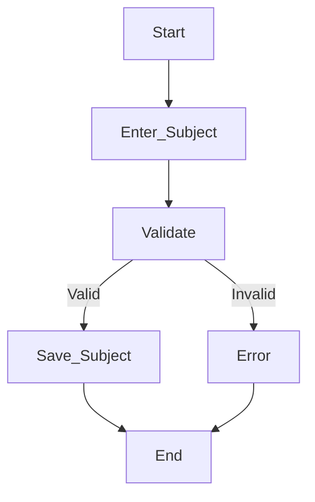
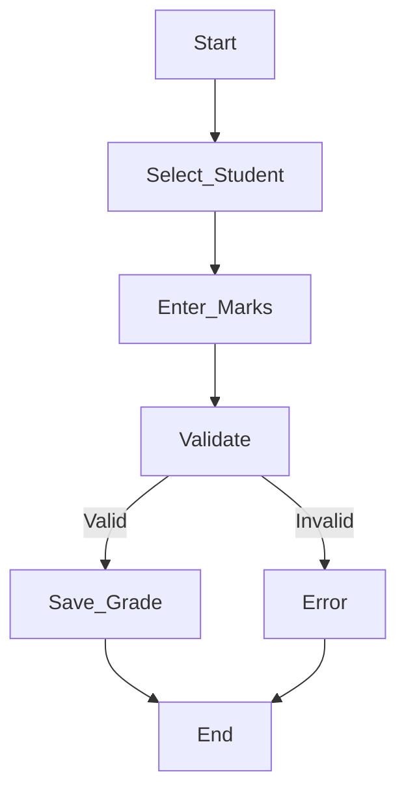
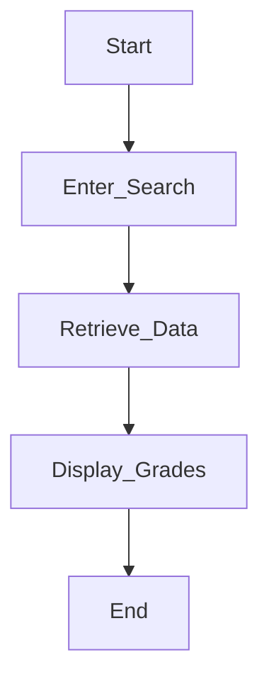
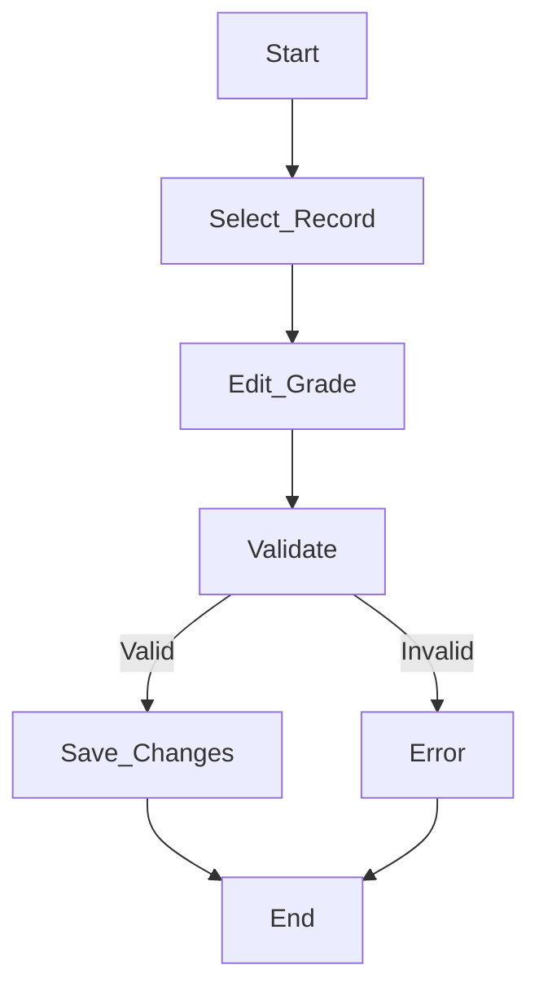
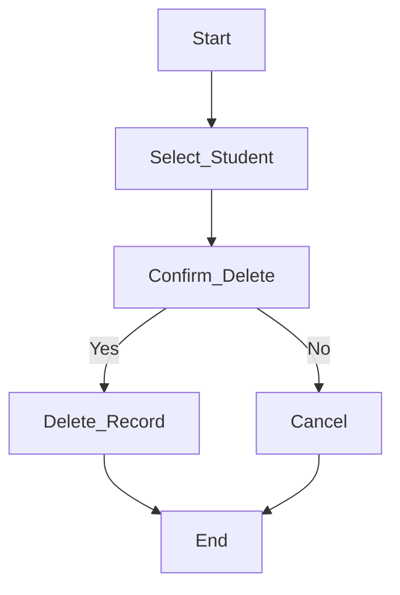
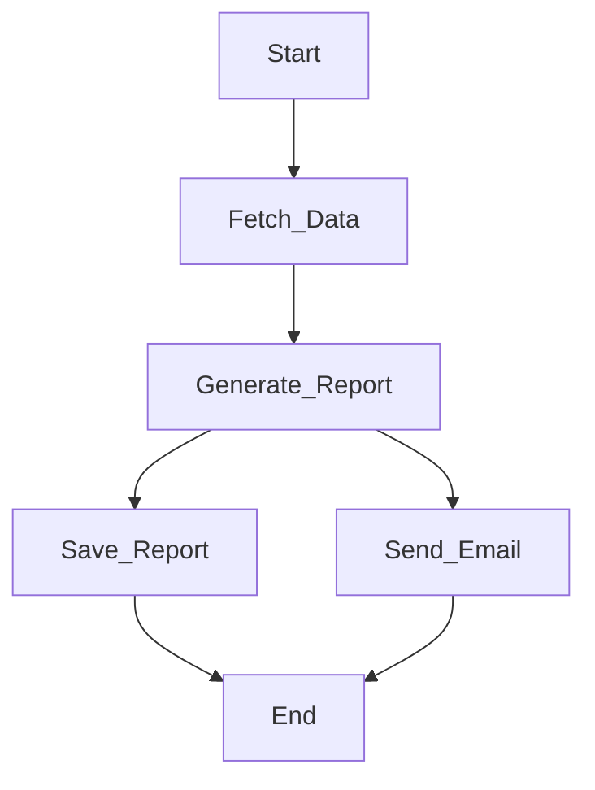
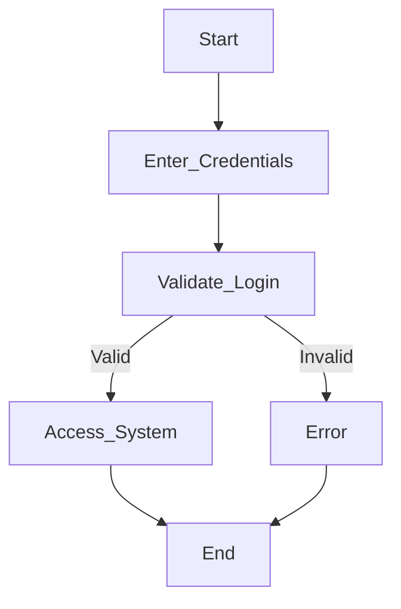

# Activity Diagrams – Student Grade Management System

---

## 1. Add Student

---

## 2. Add Subject

---

## 3. Capture Grades

---

## 4. View Grades

---

## 5. Update Grades

---

## 6. Delete Student

---

## 7. Generate Report (Parallel Process ⭐)

---

## 8. Login Process

