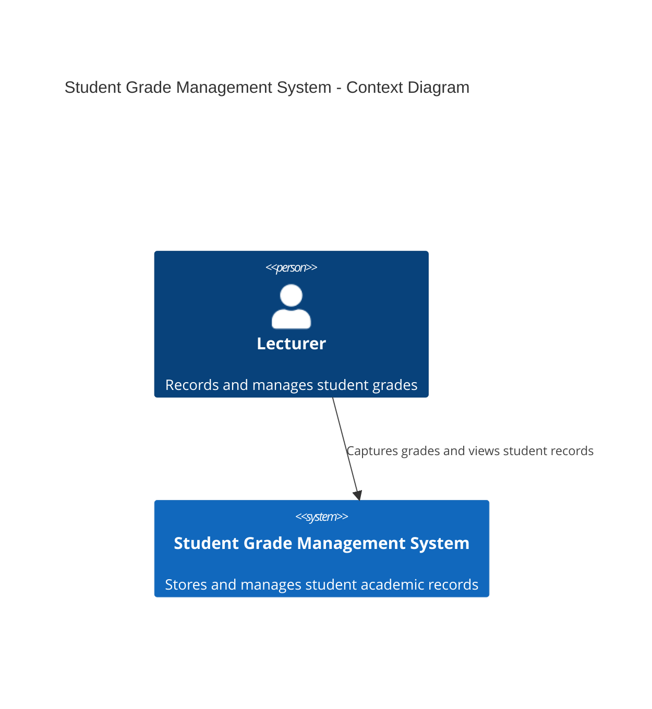
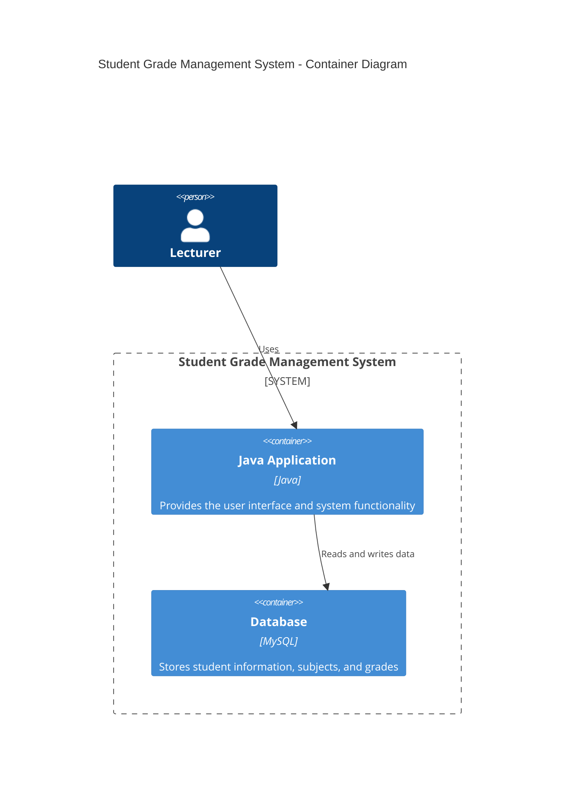

# Student Grade Management System Architecture

## C4 Context Diagram

The context diagram shows how the main user interacts with the system.

## C4 Container Diagram

The container diagram shows the main components of the system and how they interact.

