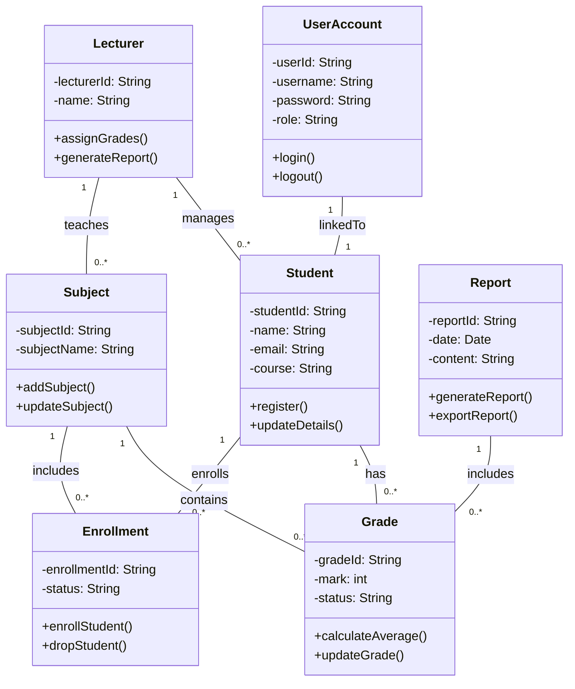

# Class Diagram – Student Grade Management System

## Mermaid Class Diagram

---

## Explanation

The class diagram represents the structure of the system using object-oriented principles.

* **Encapsulation** is applied by defining attributes and methods within each class.
* **Associations** show relationships such as Student–Grade and Subject–Enrollment.
* **Multiplicity** defines how many objects are related (e.g., one student can have many grades).
* **Separation of concerns** ensures each class has a specific responsibility.

This design aligns with system requirements and supports scalability and maintainability.
