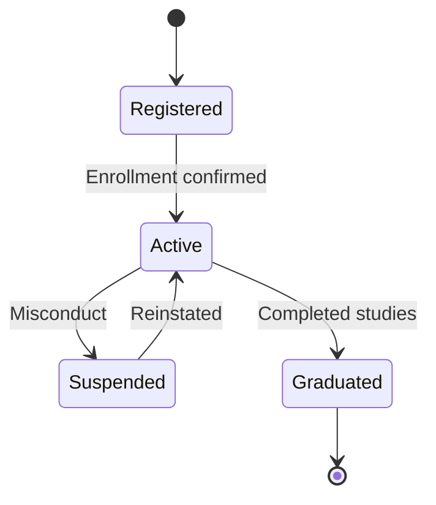
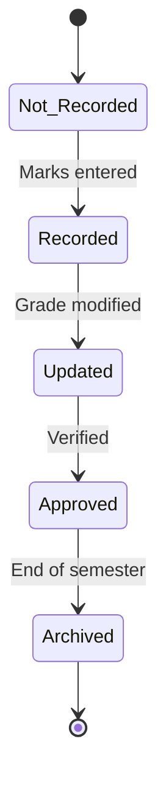
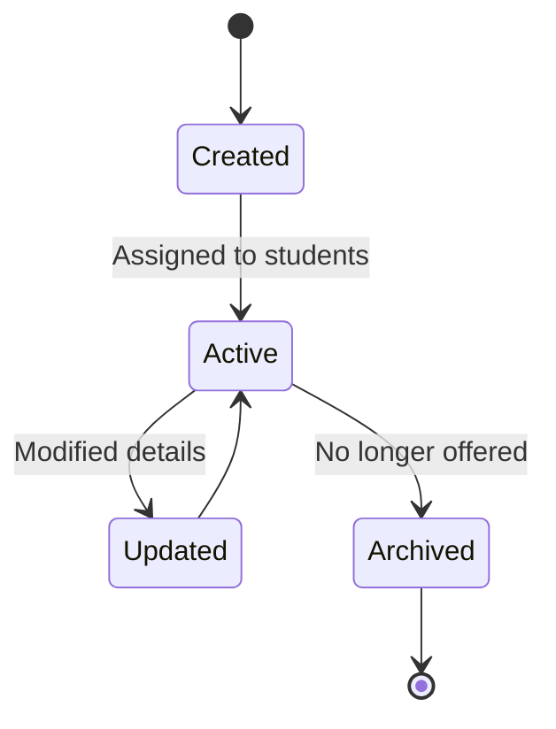
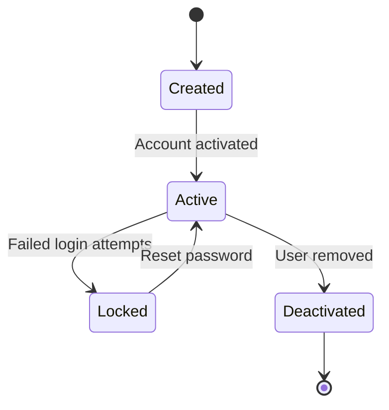
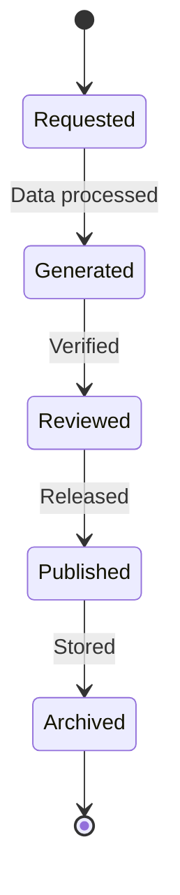
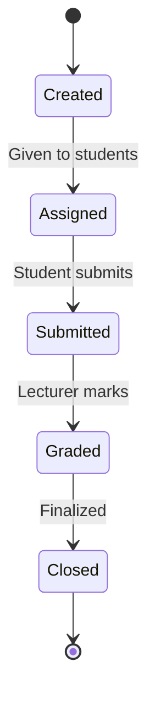
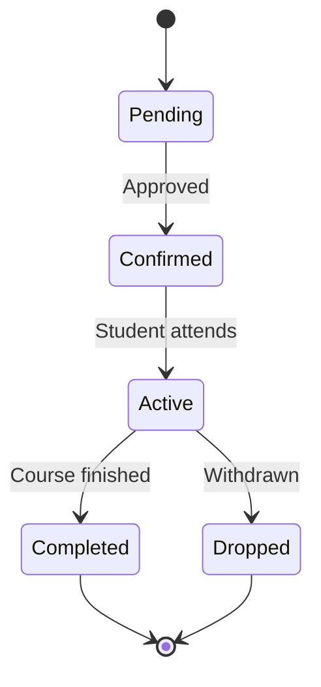

# State Transition Diagrams – Student Grade Management System

---

## 1. Student

---

## 2. Grade

---

## 3. Subject

---

## 4. User Account

---

## 5. Report

---

## 6. Assignment

---

## 7. Enrollment

